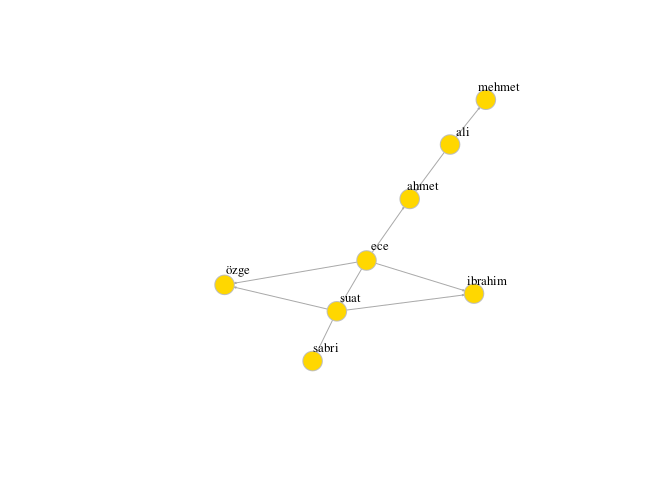
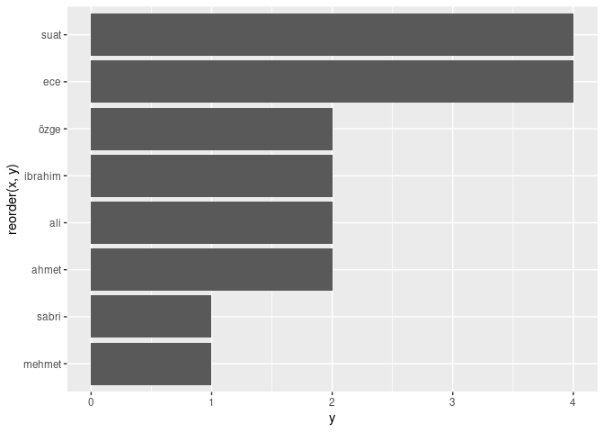

degree
================
Dr. Suat ATAN
28 02 2021

# Import Data and Plot Network

``` r
library(igraph)
library(readr)
setwd("/home/suat/Belgeler/github/network-analysis-lecture")
df <- readr::read_csv("data/02.csv")
g <- graph_from_data_frame(df)
layout <- layout.fruchterman.reingold(g)
# Plotting with configuration
plot(g, 
     edge.arrow.size=.1, 
     vertex.color="gold", 
     vertex.size=15,
     vertex.frame.color="gray", 
     vertex.label.color="black", 
     vertex.label.cex=0.8, 
     vertex.label.dist=2, 
     edge.curved=0,
     layout=layout) 
```

<!-- -->

# Calculating Degree Distribution

``` r
deg <- degree(g)
x = names(deg)
y = deg
ddist = data.frame(x,y)
ddist
```

    ##               x y
    ## ece         ece 4
    ## suat       suat 4
    ## ali         ali 2
    ## özge       özge 2
    ## ibrahim ibrahim 2
    ## ahmet     ahmet 2
    ## sabri     sabri 1
    ## mehmet   mehmet 1

# Plotting degree distribution

``` r
library(ggplot2)
ggplot(ddist, aes(x=reorder(x,y), y=y)) + 
  geom_bar(stat = "identity") +
  coord_flip()
```

<!-- -->
