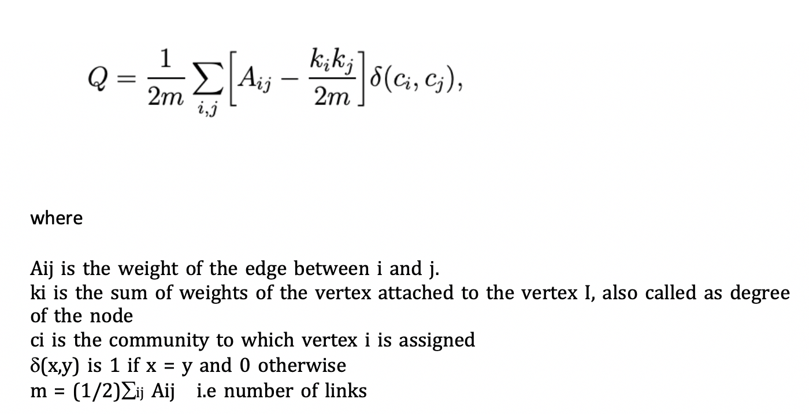
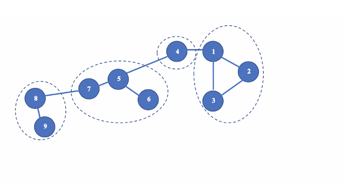
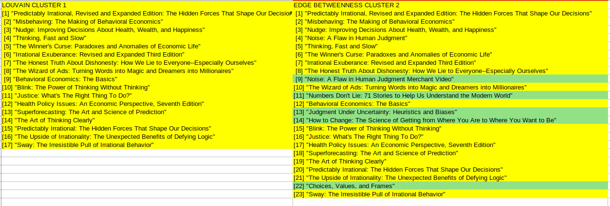

```{r}

```

```{r setup, include=FALSE}
knitr::opts_chunk$set(echo = TRUE)
```


## Data Preprocessing

```{r message=FALSE, warning=FALSE}
library(readr)
library(dplyr)
amazon <- read_csv("../data/amazon.csv")
amazon %>% 
   select(title,viewed_bought,rating,rating_count,isbn) %>% 
   filter(title != "") %>% 
   filter(viewed_bought != "") %>%
   filter(!grepl("img alt",viewed_bought)) -> df
df
```
## Generating Degree and Vertex Labels
```{r message=FALSE, warning=FALSE}
library(igraph)
g<-graph_from_data_frame(df)
DEG = tryCatch(degree(g))
VERTEXLAB = ifelse(DEG > 10, V(g)$name, NA)
```


## Initial Plotting

```{r}
plot(g,
      vertex.size = degree(g),
      vertex.label.cex = .7, 
      vertex.label = VERTEXLAB,
      edge.arrow.size=.2,
      layout = layout.fruchterman.reingold(g))
```

## Plot with Rescaling and Exporting

```{r}
lo <- layout_with_kk(g) ## create a layout

lo <- norm_coords(lo, ymin=-1, ymax=1, xmin=-1, xmax=1)
## I think this tells igraph to normalize the coordinates of the 
## layout relative to the space you're working with


resfactor = 3
png(filename="amazon.png", res = 72*resfactor, height=2500*resfactor, width=1900*resfactor)

plot(g, edge.arrow.width = .25,
     edge.arrow.size = .25,
     vertex.label.dist = 1,
     vertex.label.cex = .74,
     vertex.size = 5, 
     rescale=FALSE, 
     layout=lo*2)
dev.off()
```

## Plotting with Simpify

```{r}
plot(simplify(g), 
     vertex.size= 0.01,
     edge.arrow.size=0.001,
     vertex.label.cex = 0.75,
     vertex.label.color = "black"  ,
     vertex.frame.color = adjustcolor("white", alpha.f = 0),
     vertex.color = adjustcolor("white", alpha.f = 0),
     edge.color=adjustcolor(1, alpha.f = 0.15),
     display.isolates=FALSE,vertex.label=ifelse(page_rank(g)$vector > 0.007 , V(g)$name, NA),
     layout = layout.auto(simplify(g)))
```
## Plotting with Most Important Labels

```{r}
## this ensures the starting random position is the same
## for the layouts that use a random starting position
set.seed(225) 

ig <- g
l <- layout.fruchterman.reingold(ig, niter=3000, area=vcount(ig)^5*10)

DEG = tryCatch(degree(ig))

VERTEXLAB = ifelse(DEG > 25, V(g)$name, NA)

plot(ig, layout=l, 
     edge.arrow.size=0.005, 
     vertex.label.family="Helvetica",
     vertex.label.font=2,
     vertex.shape="circle", 
     vertex.size=DEG, 
     vertex.label.color="black", 
     vertex.size = degree(ig),
     vertex.label.cex = .7, 
     vertex.label = VERTEXLAB,
     edge.arrow.size=.02,
     edge.width=0.5)
```
## Plot with VisNetwork

- Advantages: Zoomable, Clickable, Neigboor Highlight, Possibility of change node positions, embedding to web apps, selecting ID by combo box

- Disadvantages: Reporting overall network

- Solution: Printing different parts

```{r message=FALSE, warning=FALSE}
library(visNetwork)
library(dplyr)
V(g)$size <- degree(g)
V(g)$color <- c("green", "grey","blue","red","orange","yellow")
#V(g)$color <- c("green")
visNetwork::visIgraph(g, physics= FALSE)%>% 
  visInteraction(navigationButtons = TRUE) %>% 
   visOptions(selectedBy = "group", 
                highlightNearest = TRUE, 
                nodesIdSelection = TRUE) %>%
                  visPhysics(stabilization = FALSE)
``` 


## Listing by degree centrality

What it means? (1) There are some books that has living in the intersection of the book that viewing by the user and searched by the same users. These books has high likelihood of popularity from some reasons.  
(2) The first book is the initial books that algorithm has started to search.

```{r}
data.frame(degree(g)) %>% arrange(desc(`degree.g.`))
```

## Cliques

What it means(?) Remember the definition. A clique is fully connected full network. (2) As you see in the  all cliques are related topics because a person for instance has interest to finance looks finance book (Clique 1), (3) Look clique 5: It is totally about the topics out of finance.

```{r}
max_cliques(g,min=4)
```

##  Louvain’s Algorithm for Community Detection:

>Louvain’s algorithm was proposed by Vincent D. Blondel, Jean-Loup Guillaume, Renaud Lambiotte and Etienne Lefebvre in this paper in 2008. It was named after the city in Belgium where one of the proposers Etienne Lefebvre first developed this algorithm during his Master thesis at UCL( Louvain-la-Neuve ) in March,2007.

## Introduction and Cost Function

>Any unsupervised or supervised machine learning algorithm needs a loss/optimisation/cost function to decide on the convergence criterion. In the community detection scenario, Modularity is one most suitable optimisation metric. Louvain’s algorithm is based on optimising the Modularity very effectively. Before discussing the steps followed in the algorithm, let us understand Modularity concept first.

## Introduction and Cost Function

> The quality of the communities referred as partitions hereafter is measured by Modularity of the partition. Modularity Q is defined as the formula shown in the below figure.
[Source](https://medium.com/walmartglobaltech/demystifying-louvains-algorithm-and-its-implementation-in-gpu-9a07cdd3b010)


## Introduction and Cost Function



## Louvain Basic Example

Finding best segmentation that all clusters are best modularity 




## Finding Structures with Louvain

```{r}
gx <- graph_from_data_frame(df,directed=F)
cluster_louvain(gx)[1:2]
```
## Visualization with Louvain Clusters

```{r}
## greedy method (hiearchical, fast method)
c3 = cluster_louvain(gx)
coords = layout_with_fr(gx)

## modularity measure
modularity(c3)
### [1] 0.4012985
## plot communities with shaded regions
DEG = tryCatch(degree(gx))

VERTEXLAB = ifelse(DEG > 10, V(gx)$name, NA)

plot(c3, gx, layout=coords,
      vertex.size = .3,
      vertex.label.cex = .7, 
      vertex.label = VERTEXLAB)
```

## Visualization with Edge Betweenness Clusters

As you see it calculates different communities

The idea of the edge betweenness based community structure detection is that it is likely that edges connecting separate modules have high edge betweenness as all the shortest paths from one module to another 

```{r}
## greedy method (hiearchical, fast method)
c3 = cluster_edge_betweenness(gx)
coords = layout_with_fr(gx)

## modularity measure
modularity(c3)
### [1] 0.4012985
## plot communities with shaded regions
DEG = tryCatch(degree(gx))

VERTEXLAB = ifelse(DEG > 10, V(gx)$name, NA)

plot(c3, gx, layout=coords,
      vertex.size = .3,
      vertex.label.cex = .7, 
      vertex.label = VERTEXLAB)
```

## List Based by Edge Betweenness Cluster
```{r}
c3 = cluster_edge_betweenness(gx)
c3[1:2]
```
## Comparison

Almost same




## Correlation of Degree Centrality and User's Ratings

Getting degrrees

```{r}
data.frame(degree(g)) %>% arrange(desc(`degree.g.`)) -> cdf
cdf$title = rownames(cdf)
rownames(cdf) <- NULL
cdf %>% select(title,`degree.g.`) -> cdf
cdf
```


## Correlation of Degree Centrality and User's Ratings

Inner Join Degree and Rating table

```{r}
df %>% select(title,rating) -> rdf
merge(cdf,rdf,by ="title") -> mdf
unique(mdf) -> umdf
umdf
```


## Convert rating to numbers

```{r}
## get last digit because all over 4
numerify <- function(rating_string){
   return(as.numeric(substr(rating_string,3,3)))
}
umdf %>% mutate(rating_numeric = numerify(rating)) -> xumdf
xumdf %>% filter(!is.na(rating_numeric)) -> yumdf
yumdf
```

## Correlation of Degree Centrality and User's Ratings

```{r}
cor(yumdf$rating_numeric,yumdf$degree.g.)
```
Low correlation

## Correlation of Degree Centrality and User's Ratings

```{r}
plot(yumdf$rating_numeric,yumdf$degree.g.)
```


## Trying another predictor (betwenness)

```{r}
data.frame(betweenness(g)) %>% arrange(desc(`betweenness.g.`)) -> cdf
cdf$title = rownames(cdf)
rownames(cdf) <- NULL
cdf %>% select(title,`betweenness.g.`) -> cdf

df %>% select(title,rating) -> rdf
merge(cdf,rdf,by ="title") -> mdf
unique(mdf) -> umdf

## get last digit because all over 4
numerify <- function(rating_string){
   return(as.numeric(substr(rating_string,3,3)))
}
umdf %>% mutate(rating_numeric = numerify(rating)) -> xumdf
xumdf %>% filter(!is.na(rating_numeric)) -> yumdf

cor(yumdf$rating_numeric,yumdf$betweenness.g.)
```


## Trying another predictor

```{r}
data.frame(degree(g,mode = "out")) -> a
colnames(a) = c("metric")

a %>% arrange(desc(metric)) -> cdf
cdf$title = rownames(cdf)
rownames(cdf) <- NULL
cdf %>% select(title,metric) -> cdf

df %>% select(title,rating) -> rdf
merge(cdf,rdf,by ="title") -> mdf
unique(mdf) -> umdf

## get last digit because all over 4
numerify <- function(rating_string){
   return(as.numeric(substr(rating_string,3,3)))
}
umdf %>% mutate(rating_numeric = numerify(rating)) -> xumdf
xumdf %>% filter(!is.na(rating_numeric)) -> yumdf

cor(yumdf$rating_numeric,yumdf$metric)
```
##  Correlation by membership

```{r}
c3 = cluster_edge_betweenness(gx)
clusterno<- as.data.frame(c3$membership)
title <- as.data.frame(c3$names)
cbind(clusterno,title) -> cludf
colnames(cludf) <- c("clusterno","title")
cludf
```

```{r}
df %>% select(title,rating) -> rdf
merge(cdf,rdf,by ="title") -> mdf
unique(mdf) -> umdf
umdf %>% mutate(rating_numeric = numerify(rating)) -> xumdf
xumdf %>% filter(!is.na(rating_numeric)) -> yumdf
yumdf
#merge
merge(cludf,yumdf) -> cluster_df

cluster_df %>% group_by(clusterno) %>% summarize(mean_rating = mean(rating_numeric))
```

```{r}
cor(cluster_df$clusterno,cluster_df$rating_numeric)
```

