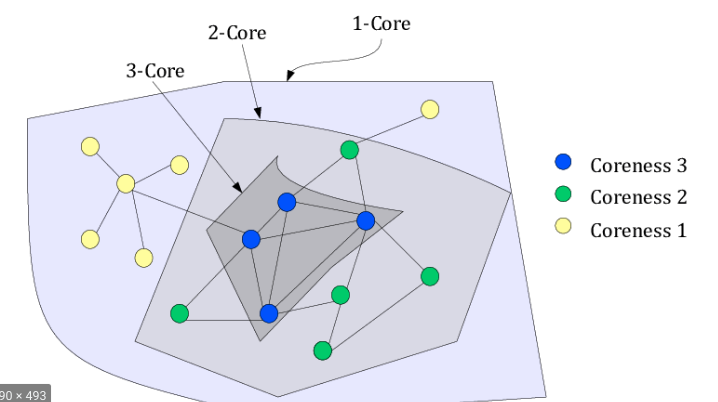

```{r setup, include=FALSE}
knitr::opts_chunk$set(echo = FALSE)
```


## Week 6

-   Subgroups & Communities

-   Cliques

-   K-Core

-   Modularity

-   Community Detection Methods

## Community definition

Wassserman and Faust, Social Network Analysis, Methods and Applications

" A community is subset of actors among whom there are relatively strong, direct, **intense**, frequent of positive ties"

## Key Element: The Social Cohesion

-   One way to think about network subgroups is through **social cohesion**.
-   This approach is so intuitive that it led to a number of the earliest techniques for identifying network subgroups.
-   i.e: Cliques

## What is a community

-   Sometimes visually detectable

-   Have more connections among each according to other nodes

-   It is not "random"

## Where is a community?

The strength of weak ties, Granovetter (1973) suggested that many social networks are made up of relatively densely connected subgroups.

Luke, Douglas A - A User's Guide to Network Analysis

## Where is a community?

Many disciplines have theories that assume that larger social systems are made up of distinguishable subgroups, for example sociologists consider social classes; psychologists examine small group behavior, and public health examine health disparities between different social groups.

Luke, Douglas A - A User's Guide to Network Analysis

## A Community Example

```{r message=FALSE, warning=FALSE}

library(igraph)
g <- graph_from_literal(A--B,B--C,A--C,C--D,B--D,A--D,
                        C--X,X--Y,Y--Z,X--Z,Z--Q,X--Q,Y--Q)
plot(g)
```

## Hidden Communities

-   In most real-world social networks the communities are not as visible
-   Systematic analysis or observation will be required to reveal it.
-   How ?

## Hidden Communities (Where are the communities?)

```{r message=FALSE, warning=FALSE}
library(igraph)
rand <- random.graph.game(20,1/3)
plot(rand)
```

## Clique

-   Cliques are one of the simplest types of cohesive subgroups, and because of their straightforward definition are also one of the easiest types to understand.
-   A clique is a **maximally complete subgraph**; that is, it is a subset of nodes that have all possible ties among them.

Luke, Douglas A - A User's Guide to Network Analysis

## Clique Example / Tasks:

-   Focus on the next slide and think

-   Detect the communities visually

-   Why they are community?

-   What about X and C ?

## Clique Example

```{r message=FALSE, warning=FALSE}
library(igraph)
g <- graph_from_literal(A--B,B--C,A--C,C--D,B--D,A--D,
                        C--X,X--Y,Y--Z,X--Z,Z--Q,X--Q,Y--Q)
plot(g)
```

## Cliques

-   Consider previous slide. To be a clique, A,B,C,D all of the 6 possible ties must exist between all 4 members.

-   If only one is missing, then the seven connections will not belong to one clique.

## Clique Definition

-   Fully connected subgroups

-   Dyads are fully connected but they are not defined as "clique"

-   Isn't very conservative?

## Just one missing connection!

It is no longer a clique:

```{r message=FALSE, warning=FALSE}
library(igraph)
g <- graph_from_literal(B--C,A--C,C--D,B--D,A--D,
                        C--X,X--Y,Y--Z,X--Z,Z--Q,X--Q,Y--Q)
plot(g)
```


## Cliques 1 (R)

```{r}
df2 <- read.csv("../data/02.csv")
g2 <- graph_from_data_frame(df2)
plot(g2)
```

## Cliques 2 (R)

```{r echo=TRUE, message=FALSE, warning=FALSE}
cliques(g2,min = 3)
```

## Clique is not realistic definition

Cliques, have major disadvantage that reduce their utility in real-world social network analysis. A clique is a very conservative definition of a community.

## K-Core

-   Variations on the clique concept have been proposed.

-   A popular alternative is the k-core.

-   **Formal Definition**: A k-core is a **maximal subgraph** where each node is connected to at least k other nodes in the subgraph ?

## K-Core (Step by Step Definition)

```{r echo=FALSE, message=FALSE, warning=FALSE}
library(igraph)
kgraf <- graph_from_literal(A--B,B--C,C--D,A--D,B--D,A--D,C--A,
                            B--X,B--Y,D--Q,D--W,
                            M--N, N--G,
                            N-D)
plot(kgraf,layout=layout.kamada.kawai(kgraf))
```

## K-Core 1

-   Delete the nodes have only one connection

-   What remains?

-   K-Core: 2 subgraph

```{r echo=FALSE, message=FALSE, warning=FALSE}
library(igraph)
kgraf2 <- graph_from_literal(A-B,B-C,C-D,A-D,B-D,A-D,C-A)
plot(kgraf2,layout=layout.kamada.kawai(kgraf2))
```

## K-Core 2

Distributed k-Core Decomposition, March 2011,IEEE Transactions on Parallel and Distributed Systems 24(2)

[{width="300" height="200"}](K-Core)

## K-Core (R)

```{r message=FALSE, warning=FALSE}
library(igraph)
golem <- graph_from_literal(A---B,B---C,A---D,A---E,B--E,E---D,D---F)
plot(golem)
```

## K-Core (R)

-   A,B,E,D are minimum 2 connection. They are members of k-core:2
-   C,F is minimum (just) one connection. They are members of k-core:1

```{r echo=TRUE, message=FALSE, warning=FALSE, paged.print=FALSE}
coreness(golem)
```

## Colorize K-Core 1

```{r echo=TRUE}
golem <- set_vertex_attr(golem,"core",
                         index= V(golem),
                         coreness(golem))
```

## Colorize K-Core 2

```{r}
V(golem)$core
```

## Colorize K-Core 3

```{r echo=TRUE}
V(golem)$color = ifelse(V(golem)$core ==1,
                        "red",
                        "green")
V(golem)$color
```

## Colorize K-Core 4

```{r}
plot(golem)
```

## K-Core For Complex Network (R) 1

```{r echo=TRUE}
df2 <- read.csv("../data/02.csv")
g2 <- graph_from_data_frame(df2)
plot(g2)
```

## K-Core For Complex Network (R) 2

```{r echo=TRUE}
g2 <- set_vertex_attr(g2,"core",
                      index= V(g2),
                      coreness(g2))
V(g2)$color = ifelse(V(g2)$core ==1,"red","green")
plot(g2)
```

## K-Core For Random Game (R) 3

```{r echo=TRUE, message=FALSE, warning=FALSE}
bignet <- random.graph.game(n = 100,
                            p.or.m = 1/20,
                            directed = F)
plot(bignet,vertex.label.cex=0.9,vertex.size=2)
```

## K-Core For Random Game(R) 4

```{r echo=TRUE}
coreness(bignet)
```

## K-Core For Random Game(R) 5

```{r echo=TRUE}
bignet <- set_vertex_attr(bignet,"core",
                          index= V(bignet),
                          coreness(bignet))
V(bignet)$color = V(bignet)$core
plot(bignet,vertex.label.cex=0.9,
     layout=layout.kamada.kawai(bignet))
```


## Modularity Definition

>Modularity is a measure of the structure of the net-work, specifically the extent to which nodes exhibit clustering where there is greater density within the clusters and less density between them (Newman2006)

## Case 1: Xenophobic

```{r echo=TRUE}
moda <- read.csv("../data/modular-a.csv")
moda
```
## Case 1: Set origins: Russian or Turkish

```{r echo=TRUE}
gmoda <- graph_from_data_frame(moda,directed = FALSE)
grepl("ov","raskov")
V(gmoda)$origin = ifelse(grepl("ov",
                               V(gmoda)$name),"russian","turkish")
V(gmoda)$color = ifelse(grepl("ov",
                              V(gmoda)$name),"blue","red")
V(gmoda)$origin_id = ifelse(grepl("ov",
                                  V(gmoda)$name),1,2)
V(gmoda)$origin
```

## Case 1

```{r}
plot(gmoda,
     vertex.color=V(gmoda)$color,
     vertex.size=10,
     vertex.label.color="black",
     vertex.label.cex=1.1,
     layout= layout.fruchterman.reingold(gmoda))

```

## Modularity of Case 1

Calculation with R:

```{r echo=TRUE}
modularity(gmoda,V(gmoda)$origin_id,)
```
Parameter 1: Graph object, Parameter 2: Vertices


## Case 2: Multicultural 

```{r echo=TRUE}
modb <- read.csv("../data/modular-b.csv")
modb
```

## Case 2: Set origins 

```{r echo=TRUE, size="\\tiny"}
gmodb <- graph_from_data_frame(modb,directed = FALSE)
V(gmodb)$origin = ifelse(grepl("ov",
                               V(gmodb)$name),
                         "russian","turkish")
V(gmodb)$color = ifelse(grepl("ov",
                              V(gmodb)$name),
                        "blue","red")
V(gmodb)$origin_id = ifelse(grepl("ov",
                                  V(gmodb)$name),
                            1,2)
V(gmodb)$origin

```

## Case 2:  Multicultural

```{r}
plot(gmodb,
     vertex.color=V(gmodb)$color,
     vertex.size=10,
     vertex.label.color="black",
     vertex.label.cex=1.1,
     layout= layout.fruchterman.reingold(gmodb))

```

## Modularity of Case 2

Calculation with R

```{r echo=TRUE}
modularity(gmodb,V(gmodb)$origin_id)
```

Parameter 1: Graph object, Parameter 2: Vertices

## The End

Thanks

Dr. Suat ATAN
