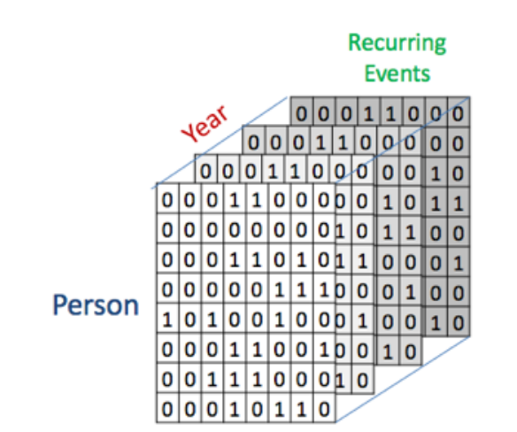

```{r setup, include=FALSE}
knitr::opts_chunk$set(echo = TRUE)
```

# Week 8

## Plan

- Affiliation Networks
  - Visualization
  - Projections
  - Data Model
- Cutpoints
- Other Network Packages
  - statnet
  - network
  - intergraph
  - visNetwork
  - networkD3


## Theory

A tribe is a group of people connected to one another, connected to a
leader, and connected to an idea. For millions of years, human beings
have been part of one tribe or another. A group needs only two things to
be a tribe: a shared interest and a way to communicate. (Seth Godin --
Tribes: We Need You to Lead Us)

::: {.notes}
Until now, all the networks that we have examined are based on direct
ties. That is, the social ties connecting the actors in the social
network have been confirmed through self-report, direct observation, or
some other type of data collection that tells us how actors are directly
connected to one another. However, social scientists are often
interested in situations where there may be the opportunity for social
relationships, but these relationships cannot be directly observed.
However, by virtue of occupying the same social situation, we may infer
that there is an opportunity or potential for social connections.
:::

## Affiliation Networks

-   Person 1 - Idea 1
-   Person 2 - Idea 1
-   Person 3 - Idea 2

A network but the members have two class not one.

::: {.notes}
We call this new type of social network an affiliation network. An
affiliation network is a network where the members are affiliated with
one another based on co-membership in a group, or co-participation in
some type of event. For example, students who all belong to the same
class can be thought of as being connected to one another, although we
may not know whether they actually have direct social ties.
:::

## Board memberships

-   Company A - Director X
-   Company B - Directory Y
-   Company C - Director Y

::: {.notes}
The classic example from network science is the case of corporate
interlocks. Company directors have the opportunity to interact with each
other when they sit together on the same corporate board of directors.
Moreover, the companies them- selves can be seen to be connected through
their shared director memberships. That is, when the same director sits
on two different company boards, those compa- nies are connected through
that director. Sociologists and political scientists have used these
types of affiliation networks to explain how companies tend to behave in
similar ways to one another (Galaskiewicz 1985).
:::

## Edge List

```{r}
standard.df <- read.csv("../data/02.csv")
standard.df
```

# Data Model

## Adjacency Matrix

```{r message=FALSE, warning=FALSE}
library(igraph)
standard.g <- graph_from_data_frame(standard.df)
get.adjacency(standard.g)
```

## Affiliations as 2-Mode Networks (INcidence Matrix)

```{r}
C1 <- c(1,1,1,0,0,0)
C2 <- c(0,1,1,1,0,0)
C3 <- c(0,0,1,1,1,0)
C4 <- c(0,0,0,0,1,1)
aff.df <- data.frame(C1,C2,C3,C4)
row.names(aff.df) <- c("Selçuk Mert","Ezgi","İbrahim","Kayra","Ece","X")
aff.df
```

::: {.notes}
As a simple example of an affiliation network, consider the following
data table of students grouped in classes

This type of data matrix is called an **incidence matrix**, and it
depicts how n actors belong to g groups. In this case we have six
students grouped into four classes. An incidence matrix is similar to an
**adjacency matrix**, but an adjacency matrix is an nxn square matrix
where each dimension refers to the actors in the network. An incidence
matrix, on the other hand, is an nxg rectangular matrix with two
different dimensions: actors and groups. For this reason, affiliation
networks are also known as two-mode networks.
:::

## Raw Visualization

```{r}
#focus to the function. We doesn't use graph_from_data_frame 
plot(graph_from_incidence_matrix(aff.df))
```

## Stylized Visualization

Class: Red, Student Green

```{r}
library(igraph)
bn <- graph.incidence(aff.df)

shapes <- c("circle","square")
colors <- c("green","red")
plot(bn,vertex.color=colors[V(bn)$type+1],
vertex.shape=shapes[V(bn)$type+1],
vertex.size=10,vertex.label.degree=-pi/2,
vertex.label.dist=1.2,vertex.label.cex=0.9)
```

## Map Visualization

```{r}
library(igraph)
bn <- graph.incidence(aff.df)

# map layout

plt.x <- c(rep(2,6),rep(4,4))
plt.y <- c(7:2,6:3)
lay <- as.matrix(cbind(plt.x,plt.y))

shapes <- c("circle","square")
colors <- c("green","red")
plot(bn,vertex.color=colors[V(bn)$type+1],
vertex.shape=shapes[V(bn)$type+1],
vertex.size=10,vertex.label.degree=-pi/2,
vertex.label.dist=1.2,vertex.label.cex=0.9,
layout = lay)
```

# Projections

## We are in the same class !

Focus to two proj's: - proj1: Student's co-occurence - proj2: Class
relations

```{r}
bn.pr <- bipartite.projection(bn)
bn.pr
```

## Assigning projections

```{r}
bn.student <- bn.pr$proj1
bn.class <- bn.pr$proj2
```

## Student's co-occurence matrix

```{r}
get.adjacency(bn.student,sparse=FALSE,attr="weight")
```

## Class Relations Matrix

```{r}
get.adjacency(bn.class,sparse=FALSE,attr="weight")
```

## Seperation

```{r}
shapes <- c("circle","square")
colors <- c("blue","red")
op <- par(mfrow=c(1,2))
plot(bn.student,vertex.color="blue",
vertex.shape="circle",main="Students",
edge.width=E(bn.student)$weight*2,
vertex.size=15,vertex.label.degree=-pi/2,
vertex.label.dist=1.2,vertex.label.cex=1)
plot(bn.class,vertex.color="red",
vertex.shape="square",main="Classes",
edge.width=E(bn.student)$weight*2,
vertex.size=15,vertex.label.degree=-pi/2,
vertex.label.dist=1.2,vertex.label.cex=1)
par(op)
```

## Conceptualization 3d or more



Source:
[Mi-Fu](https://www.mi.fu-berlin.de/en/inf/groups/hcc/teaching/Past-Terms/Winter-Term-2015_16/CNA_Resources/05_CNA.pdf)

## Advantages and disadvantages

**Advantages:**

-   They highlight the connectivity in the network, as well as the
    indirect chains of connection

-   Data is not lost and we always know which individuals attended which
    events/ideas/clasess

**Disadvantage:**

-   They can be unwieldy when used to depict larger affiliation networks

# CutPoints and Bridges

## Cutpoint

-   A node that, if dropped, would increase the number of components in
    the network.

-   If they were dropped, that would result in two subsets of actors
    that would not be able to communicate with each other

## Cutpoint Example

Who is cutpoint(s)?

```{r}
library(igraph)
g_mod_a <- graph_from_data_frame(read.csv("../data/modular-a.csv"),directed = F)
plot(g_mod_a)

```

## Conversion between Network Packages

Igraph does not has cutpoint function therefore we are converting it by
`intergraph` package.

```{r message=FALSE, warning=FALSE}
library(statnet) #for cutpoints function # it employs network package.
library(igraph)
library(intergraph)
g_mod_a_network = asNetwork(g_mod_a) # convert to network type compatible with statnet
```

## Finding Cutpoints

```{r}
cp <- cutpoints(g_mod_a_network,mode="graph",return.indicator = TRUE)
cp
```

## Accessing the vertex names by Network Package

```{r}
g_mod_a_network %v% "vertex.names"
```

5 and 7 are cutpoints Can and Zamyotov.

## VizNetwork

```{r message=FALSE, warning=FALSE}
library(visNetwork)
visNetwork::visIgraph(g_mod_a)
```

## Network3d

```{r}
# Load package
library(networkD3)

# Create fake data
src <- c("A", "A", "A", "A",
        "B", "B", "C", "C", "D")
target <- c("B", "C", "D", "J",
            "E", "F", "G", "H", "I")
networkData <- data.frame(src, target)

# Plot
simpleNetwork(networkData)
```

## Sankey Networks with NetworkD3

```{r}
# Load energy projection data
URL <- paste0(
        "https://cdn.rawgit.com/christophergandrud/networkD3/",
        "master/JSONdata/energy.json")
Energy <- jsonlite::fromJSON(URL)
# Plot
sankeyNetwork(Links = Energy$links, Nodes = Energy$nodes, Source = "source",
             Target = "target", Value = "value", NodeID = "name",
             units = "TWh", fontSize = 12, nodeWidth = 30)
```

## Dendograms with Network3D

```{r}
hc <- hclust(dist(USArrests), "ave")

dendroNetwork(hc, height = 600)
```

## The End
