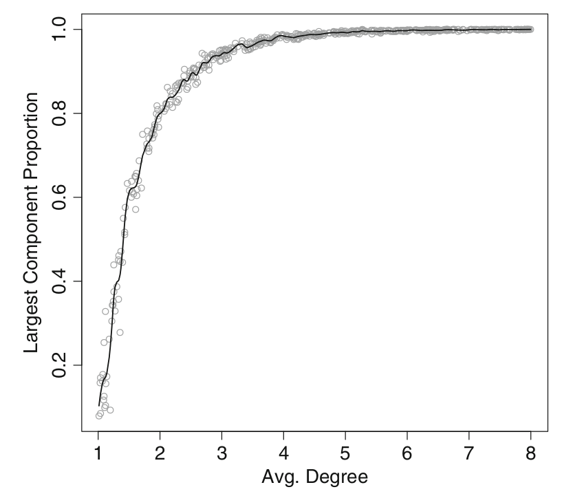
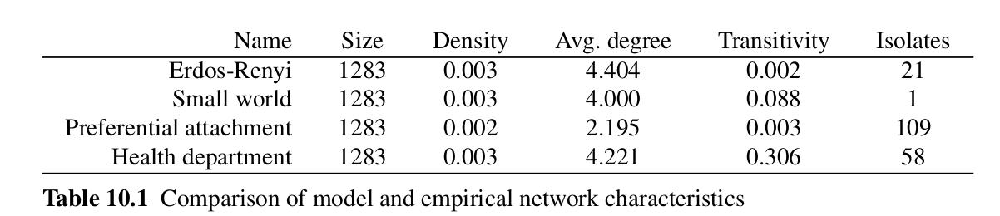
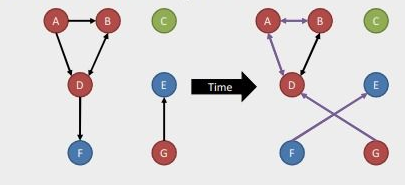
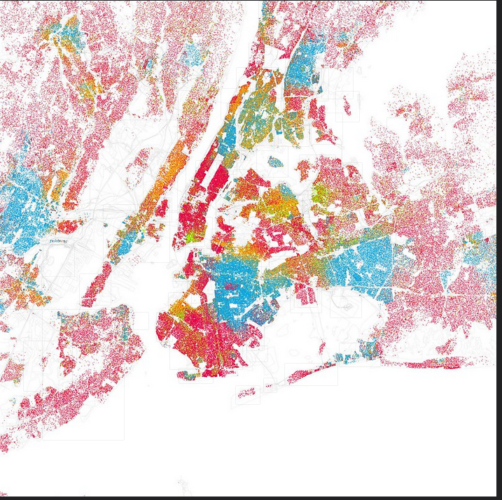

```{r setup, include=FALSE}
knitr::opts_chunk$set(echo = FALSE)
```

## Plan


Part I: Network Models

-   Erdos-Renyi Random Graph
-   Small World Model
-   Scale-Free Model

Part II: Some Network Concepts

- Homophily

# Part I: Network Models

## Models (1)

According to Linton Freeman (2004), modern social network analysis has
four main characteristics:

-   It is motivated by a structural intuition based on ties linking
    social actors;
-   It is grounded in systematic empirical data;

::: {.notes}
The preceding sections of this lecture focused on the first three
elements of Freeman's characterization. This lecture now turn to
consider his last point, the utility of modeling in network analysis.
Scientific models are simplified descriptions of the real world that are
used to predict or explain the characteristics or behavior of the
phenomenon of interest. Models can be used in network science in the
same way. With network models we can move beyond simple description to
build and test hypotheses about network structures, formation processes,
and network dynamics

Although there are tons of possibilities for network main motivation is
*social network* It use emprical data
:::

## Models (2)

-   It draws heavily on graphic imagery; and
-   It relies on the use of mathematical and/or computational models.

::: {.notes}
In this lecture, a number of basic mathematical models of network
structure and formation are covered. These are important models in the
history of network science, but they are still useful today to provide
insight into fundamental properties of social networks, to serve as
baseline or comparison models for empirical social networks, and to act
as building blocks for more complex network simulations.
:::

## Erdős-Rényi Random Graph Model

-   G(n,m)
-   G(n,p)
-   n: nodes
-   m: vertices
-   p: possibility

::: {.notes}
The earliest historically, and still one of the most important
mathematical models of network structure, is the random graph model
first developed by Paul Erdős and Alfred Rényi in the late 1950s and
early 1960s (Newman 2010). This is sometimes called the Poisson random
graph model (because of the Poisson degree distribu- tion of large
random graphs), or sometimes even just the random graph model.

The model is quite simple, G(n, m), where a random graph G is defined
with n vertices and m edges among those vertices chosen randomly. An
equivalent model that is easier to work with is G(n, p), where instead
of specifying m edges, each edge app- ears in the graph with probability
p.
:::

## Function Parameters

**Usage**

```{r eval=FALSE, include=FALSE}
erdos.renyi.game( n, p.or.m, type = c("gnp", "gnm"), directed = FALSE,
loops = FALSE, ... )
```


## Arguments

-   n: The number of vertices in the graph.
-   p.or.m :Either the probability for drawing an edge between two
    arbitrary vertices (G(n,p) graph), or the number of edges in the
    graph (for G(n,m) graphs).
-   type :The type of the random graph to create, either gnp (G(n,p)
    graph) or gnm (G(n,m) graph).
-   directed:Logical, whether the graph will be directed, defaults to
    FALSE.
-   loops:Logical, whether to add loop edges, defaults to FALSE.

## Function Parameters

-   In G(n,p) graphs, the graph has 'n' vertices and for each edge the
    probability that it is present in the graph is 'p'.

-   In G(n,m) graphs, the graph has 'n' vertices and 'm' edges, and the
    'm' edges are chosen uniformly randomly from the set of all possible
    edges. This set includes loop edges as well if the loops parameter
    is TRUE.

-   **random.graph.game is an alias to this function.**

## Erdős-Rényi Random Graph Model (GNM)

```{r message=FALSE, warning=FALSE}
library(igraph)
g <- erdos.renyi.game(n=12,10,type='gnm')
plot(g)
```

::: {.notes}
This random graph model is implemented in igraph with the
erdos.reny.game() function. A random graph is produced by specifying the
size of the desired network, and either the number of edges, or the
probability of observing an edge. The type argument is used to specify
whether the second argument should be interpreted as probability of an
edge p, or number of edges m.
:::

## Erdős-Rényi Random Graph Model (GNM 2)

```{r}
library(igraph)
g <- erdos.renyi.game(n=10,p.or.m = 1/5, type="gnp")
plot(g)
```

## Erdős-Rényi Random Graph Model (GNM 2)

```{r}
library(igraph)
g <- erdos.renyi.game(n=10, p.or.m = 5, type="gnm")
plot(g)
```

## Randomness of the model

```{r}
op <- par(mar=c(0,1,3,1),mfrow=c(1,2))
plot(erdos.renyi.game(n=15,10,type='gnm'),
vertex.color=3,
main="First random network")
plot(erdos.renyi.game(n=15,10,type='gnm'),
vertex.color=2,
main="Second random network")
par(op)
```

## Erdos-Renyi Interactive (GNM)

```{r interactive}
library(shiny)
inputPanel(
  sliderInput("n_nodes", label = "Number of nodes (n)",
              min = 2, max = 50, value = 10, step = 1),
  
  sliderInput("n_vertices", label = "Number of vertices (m)",
              min = 2, max = 100, value = 10, step = 1)
)
renderPlot({
  g <- erdos.renyi.game(n=input$n_nodes, p.or.m = input$n_vertices, type="gnm")
  plot(g)
})
```


## Erdos-Renyi Interactive (GNP)

```{r interactive2}
library(shiny)
inputPanel(
  sliderInput("n_nodes", label = "Number of nodes (n)",
              min = 2, max = 50, value = 10, step = 1),
  
  sliderInput("n_vertices", label = "Possibility of connection (p)",
              min = 0, max = 1, value = 10, step = 1)
)
renderPlot({
  g <- erdos.renyi.game(n=input$n_nodes, p.or.m = input$n_vertices, type="gnm")
  plot(g)
})

renderText({
    paste0("Number of ndes=", input$n, "\nDiameter=", diameter(g))
  })
```

## Nature of Erdosy Rendyi Model

- Poisson degree distribution
- Random graphs become entirely connected for fairly low values of average degree.
- Diameter of largest component is relatively small

::: {.notes}

More unexpectedly, it turns out that random graphs become entirely connected
for fairly low values of average degree. That means even when edges are determined
randomly, each individual network member does not have to be connected to too
many other members for the network itself to be connected.

Another surprising property of random graphs is that the connected random
graphs are quite compact. That is, the diameter of the largest components in ran-
dom graphs stays relatively small even for large networks
:::

##  Diameter of largest component



Source: Douglas, 2015

::: {.notes}

The above code runs a total of 250 simulations, producing random graphs from
50 to 5,000 nodes. As the plot shows, although the size of the graphs increases
across two orders of magnitude, the diameter of the largest component in each graph
increases much more slowly, from about five to ten (Fig. 10.4). These two character-
istics of random graphs: being completely connected with low average degree, and
the diameter increasing slowly relative to graph size, may be partly responsible for
some of the ‘small-world’ characteristics of real-world social networks (Newman
2010)
::: 

## Small-World Model

- Erdos Renyi Model is not reflect real-life networks
- Low levels of clustering
- More realistic alternative: **Small-World Model**
- R: Small World Model = Watts and Strogatz Model
- Small diameters in the components

::: {.notes}

The Erdős-Rényi random graph model has one major limitation in that it does not
describe the properties of many real-world social networks. In particular, fully ran-
dom graphs have degree distributions that do not match observed networks very
well, and they also have quite low levels of clustering (transitivity).

In particular, small-world model networks have more realistic levels of tran-
sitivity along with small diameters.
::: 


## Under the hood: Small-World Model

$p=0$: lattice $p=1$: Erdos Renyi. In between: Small Wordl

```{r smallworld}
library(shiny)
inputPanel(
  sliderInput("size", label = "Size:",
              min = 2, max = 50, value = 10, step = 1),
  
  sliderInput("p", label = "Possibility:",
              min = 0, max = 1, value = 10, step = 0.01)
)
renderPlot({
  g <- watts.strogatz.game(dim=1, size=input$size, nei=2,p=input$p)
  plot(g)
})

renderText({
    paste0("Number of ndes=", input$n, "\nDiameter=", diameter(g))
  })
```

::: {.notes}
The small-world model starts with a circle of nodes, where each node is con-
nected to its **c immediate neighbors** (forming a formal lattice structure). Then, a
small number of existing edges are rewired, where they are removed and then rep-
laced with another tie that connects two random nodes. If the rewiring probability
is 0, then we end up with the original lattice network. When p is 1, then we have an
Erdős-Rényi random graph. The main interesting discovery of Watts and Strogatz
(and others), is that only a small fraction of ties needs to be rewired to dramatically
reduce the diameter of the network
:::

## Scale-Free Models

- Better than Erdos Renyi and Small World Model in terms of representing real-life
- Real life networks: Heavy-tailed degree distribution

::: {.notes}
An important limitation of the previous two mathematical network models is that they produce graphs with degree distributions that are not representative of many real-world social networks. Numerous studies, in fact, have shown that a wide variety of observed networks have heavy-tailed degree distributions that approximately
follow a power law. These are typically called scale-free networks. 

For example: some websites have a very large number of other websites connected to them, but most websites have only a few connections. How does this power-law characteristic feature of scal
:::

## Barbassi Game

- Barbasi Game function is one of scale-free model example in R
- Notice: Input parameter is just number of nodes.
- No possibility or vertex connection.

```{r}
g <- barabasi.game(30, directed = FALSE)
plot(g,vertex.label=NA)
```

::: {.notes}
Barabási and Albert is implemented in
igraph with the barabasi.game() function. This is a more complicated alg-
orithm than those for the previous models, partly because this is a network growth
model, not just a static network structure model.
:::


## Under the hood: Barbassi Game


```{r barbassi}
library(shiny)
inputPanel(
  sliderInput("n", label = "Number of nodes",
              min = 2, max = 100, value = 20, step = 1)
  
)
renderPlot({
  g <- barabasi.game(input$n,directed=FALSE)
  plot(g,vertex.label=NA, vertex.size=.4)
})

renderText({
    paste0("Number of ndes=", input$n, "\nDiameter=", diameter(g))
  })
```

## Degre Distribution or Scale-Free Models

```{r barbassi2}
plot(degree.distribution(g),xlab="Degree", ylab="Proportion")
```

## Degree Visualization of Barbassi Game

```{r}
g <- barabasi.game(500, out.dist = c(0.25, 0.5, 0.25),
directed = FALSE, zero.appeal = 1)
V(g)$color <- "lightblue"
V(g)[degree(g) > 9]$color <- "red"
plot(g, vertex.label = NA, vertex.size = degree(g))
```


## Comparison for Scale-Free Models



- Comparison of generated and real network metrics

# Part II: Some Network Concepts

## Homophily

- “Homophily” — love of the same 
- Homo: Same, Phila: Love 
> “Similarity breeds connection,” the sociologists Miller McPherson, Lynn Smith-Lovin and James Cook wrote in their classic 2001 pape

## Homophily Example

>Huang et al (2009) showed that in the Massive Online Role-Playing Game Everquest players tended to interact with other players of similar age, experience and who lived near them in the real world

::: {.notes}
EXPLAIN
Homophily has predictive power in social media, so much so that researchers looking at last.fm could predict real-life friendships by examining on-line interaction, shared interests and location (Bischoff, 2012).
:::

## Homophily in Twitter

De Choudhury (2011) found that various patterns of homophily exist among different types of users on Twitter (for example, average users with about the same number of followers and followers have location and feeling homophily – i.e., they appear to work and live near each other, and they have similar reactions and views). 

::: {.notes}
In Twitter De Choudhury (2011) has shown that different types of homophily hold for different types of users (for example, normal users with roughly the same number of followers and followed have location and sentiment homophily – i.e. they tend to live and work near each other, and show similar reactions and views).
:::

## Homophily in Facebook

- Since social networks are primarily segregated by race, homophilic environments are fostered by social-networking sites like Facebook. 
- On social networking sites, this homophily can create divisions and echo chambers, where individuals with common views only communicate with each other. 

:::{.notes}
As social networks are largely divided by race, social-networking websites like Facebook also foster homophilic atmospheres.[12] When a Facebook user 'likes' or interacts with an article or post of a certain ideology, Facebook continues to show that user posts of that similar ideology (which Facebook believes they will be drawn to). 
:::


## Homophily in the Network Diagram



## Homophly (Race and Location)

Red is White, Blue is Black, Green is Asian, Orange is Hispanic, Gray is Other, and each dot is 25 people. Data from Census 2000.



Source: https://www.flickr.com/photos/walkingsf/sets/72157624812674967/

## Detecting Homophily

```{r}
library(igraph)
set.seed(5165)
gg <- random.graph.game(20, 0.3, "gnp", directed = TRUE)
V(gg)$group <- sample(1:5, 20, replace = TRUE)
V(gg)$color = V(gg)$group
plot(gg,vertex.size=9,edge.arrow.size=.2)
```


## Detection Function

```{r}
calc_homophily <- function(graph, vertex.attr) {
  V(graph)$name <- vertex_attr(graph, vertex.attr)
  edges <- get.data.frame(graph)
  
  # heterophilous ties where vertices have different `"group"` attributes
  external <- length(which(edges$from != edges$to))
  
  # homophilous ties where vertices have the same `"group"` attributes
  internal <- length(which(edges$from == edges$to))
  
  prop_external = external / nrow(edges) # proportion of ties that are heterophilous
  prop_internal = internal / nrow(edges) # proportion of ties that are homophilous (the results of your initial function)
  ei_index = (external - internal) / nrow(edges) # (EL - IL) / (EL + IL)
  
  return(prop_internal)
}
```


## Application

```{r}
print(calc_homophily(gg, "group"))
```


## Application on Turkish and Russian Friends

```{r}
library(readr)
modular_a <- read_csv("~/Belgeler/github/network-analysis-lecture/data/modular-a.csv")
gmoda <- graph_from_data_frame(modular_a)
plot(gmoda,vertex.size=9,edge.arrow.size=.2)
```

## Application on Turkish and Russian Friends

```{r}
V(gmoda)$origin = ifelse(grepl("ov",
                               V(gmoda)$name),"russian","turkish")
V(gmoda)$color = ifelse(grepl("ov",
                              V(gmoda)$name),"blue","red")
V(gmoda)$origin_id = ifelse(grepl("ov",
                                  V(gmoda)$name),1,2)
V(gmoda)$origin
```


## Application on Turkish and Russian Friends

```{r}
calc_homophily(gmoda, "origin")
```


## The End

Thanks